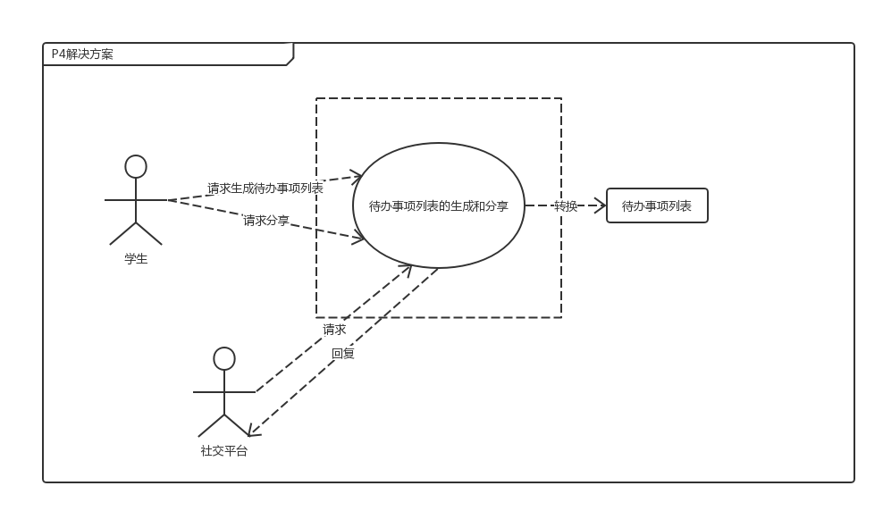
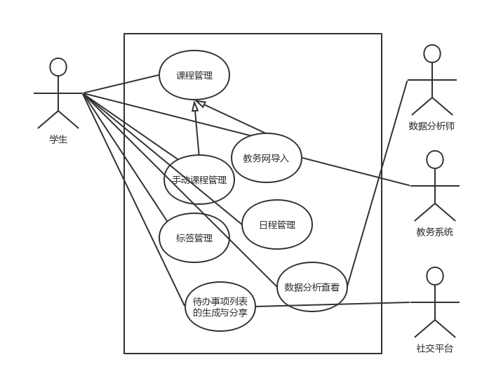

# 课程与日程管理系统过程分析文档

**南京大学软件学院16级本科**

2018年9月28日

161250024 方渤镕

161250041 侯韵晗

161250029 葛    宇

161250171 徐一舟

[TOC]

### 1.明确问题 ###
#### 1.1 对问题达成共识 ####
- 通过与客户的交流，了解现状所存在的问题
    - 问题描述
    <table border="2">
    <tr>
    <th>要素</th>
    <th>内容</th>
    </tr>
    <tr>
    <td>ID</td>
    <td>P1</td>
    </tr>
    <tr>
    <td>涉众</td>
    <td>学生，老板</td>
    </tr>
    <tr>
    <td>问题</td>
    <td>输入课程信息繁琐且容易出错，用户积极性不高</td>
    </tr>
    <tr>
    <td>影响</td>
    <td>学生不愿意使用该软件，难以使得产品得到推广与使用</td>
    </tr>
    </table>
    

    <table border="2">
    <tr>
    <th>要素</th>
    <th>内容</th>
    </tr>
    <tr>
    <td>ID</td>
    <td>P2</td>
    </tr>
    <tr>
    <td>涉众</td>
    <td>学生，数据分析员</td>
    </tr>
    <tr>
    <td>问题</td>
    <td>日程功能不智能，不能跳过节假日和周末</td>
    </tr>
    <tr>
    <td>影响</td>
    <td>学生会在假期中间被闹钟等提醒事项打扰，数据分析员的数据获取也会受到干扰</td>
    </tr>
    </table>
    

    <table border="2">
    <tr>
    <th>要素</th>
    <th>内容</th>
    </tr>
    <tr>
    <td>ID</td>
    <td>P3</td>
    </tr>
    <tr>
    <td>涉众</td>
    <td>学生，数据分析员</td>
    </tr>
    <tr>
    <td>问题</td>
    <td>不能了解日程安排情况，没有时长统计分析</td>
    </tr>
    <tr>
    <td>影响</td>
    <td>学生无法及时了解自己的日程安排，数据分析员也无法获得准确的时长数据</td>
    </tr>
    </table>
    

    <table border="2">
    <tr>
    <th>要素</th>
    <th>内容</th>
    </tr>
    <tr>
    <td>ID</td>
    <td>P4</td>
    </tr>
    <tr>
    <td>涉众</td>
    <td>学生</td>
    </tr>
    <tr>
    <td>问题</td>
    <td>不能生成便于分享的每日待办事项</td>
    </tr>
    <tr>
    <td>影响</td>
    <td>学生不能方便地与他人交流自己的安排，且不利于系统的推广</td>
    </tr>
    </table>    

#### 1.2 判断问题的明确性 ####
- 分析客户所提出的各个问题，列出不明确的问题，以便进一步与客户交流  
    - 不明确问题:
        - ID:P3
        - 问题：不能了解日程安排情况，没有时长统计分析
        - 不明确性：需要如何了解日程安排情况，如何计算时长

#### 1.3 分析不明确的问题 ####
- 对于列出的不明确问题，进行逐步分析，并通过查阅背景资料，画出鱼骨图，准备与客户交流
- P3的鱼骨图

- 通过与客户对鱼骨图分支的选择，明确真正的问题所在

- 重新定义的问题 P3  
    <table border="2">
    <tr>
    <th>要素</th>
    <th>内容</th>
    </tr>
    <tr>
    <td>ID</td>
    <td>P3</td>
    </tr>
    <tr>
    <td>涉众</td>
    <td>学生，数据分析员</td>
    </tr>
    <tr>
    <td>问题</td>
    <td>没有明确标签来划分日程安排，缺少对各类型（如娱乐，学习）时间安排的统计</td>
    </tr>
    <tr>
    <td>影响</td>
    <td>学生不能制定标签来划分自己的时间安排分析，数据分析员也无法获得准确的时长数据</td>
    </tr>
    </table>

### 2. 涉众分析

#### 2.1 涉众识别和描述
      在明确问题的同时，我们同步进行了涉众分析。通过涉众识别，我们得到了以下涉众扩展特征描述表：
      
      | 涉众       | 特征                                                 | 主要目标                                                  | 态度                                                         | 主要关注点                                           | 约束条件                             |
      | ---------- | ---------------------------------------------------- | --------------------------------------------------------- | ------------------------------------------------------------ | ---------------------------------------------------- | ------------------------------------ |
      | 学生       | 工作日里都或多或少有课程安排                         | 利用好课余时间，使自己更加充实                            | 支持                                                         | 保证自己能够更加合理的安排时间，提高自我的学习效率。 | 无                                   |
      | 老板       | 项目的投资者                                         | 获得收益                                                  | 强烈支持                                                     | 能够有更多的学生使用该app，扩大产品的流量            | 可能没有足够多懂得使用软件系统的人员 |
      | 数据分析员 | 能够对学生的日程安排进行分析，给学生提出日程安排建议 | 能 够 及 时 的 帮 助 学 生 提出均 衡 合 适 的 安 排 建 议 | 支持，但是担心自己会因给出建议效果不佳，学生卸载软件，导致丢掉工作 | 为学生制定个人化的日程时间安排                       | 无                                   |
                     

#### 2.2 涉众评估
      为了得到更深层次的涉众信息，我们采用了优先级评估涉众的方法，做出了如下User/Task 矩阵，用来评估涉众的优先级：
      
      | 用户群体   | 任务                                                         | 群体数量 | 优先级 |
      | ---------- | ------------------------------------------------------------ | -------- | ------ |
      | 学生       | 查看课程表，制定一段日期内的日程安排，查看某段日程安排的时间分配情况，可以分享自己的待办事项列表。 | 数量不限 | 3      |
      | 数据分析员 | 给学生提出日程安排建议                                       | 10       | 2      |
      | 老板       | 出资构建并维护该app                                          | 1        | 5      |

### 3. 发现业务需求

确定每一个问题对应的目标的过程就是发现业务需求的过程。因此，针对上述五个高层次问题，我们确定了对应的业务需求。将问题描述表扩展成以下的问题及业务需求描述表:

| 要素   | 内容                                                 |
| ------ | ---------------------------------------------------- |
| ID     | P1                                                   |
| 提出者 | 老板                                                 |
| 关联者 | 学生                                                 |
| 问题   | 输入课程信息繁琐且容易出错，用户积极性不高           |
| 影响   | 大学生不愿意制作课程表，搞错上课时间。               |
| 目标   | 第一版应用之后的3个月，90%以上用户通过该系统导入课程 |

| 要素   | 内容                                                     |
| ------ | -------------------------------------------------------- |
| ID     | P2                                                       |
| 提出者 | 老板                                                     |
| 关联者 | 学生                                                     |
| 问题   | 日程功能不智能，不能跳过节假日和假期。                   |
| 影响   | 学生会在假期中间被闹钟等提醒事项打扰，对日程安排评价低。 |
| 目标   | 第一版应用之后的3个月，对智能日程的好评率达到90%以上     |

| 要素   | 内容                                                         |
| ------ | ------------------------------------------------------------ |
| ID     | P3                                                           |
| 提出者 | 老板                                                         |
| 关联者 | 学生                                                         |
| 问题   | 不能了解日程安排情况，没有时长统计分析，学生得到的数据分析不直观 |
| 影响   | 学生不能制定标签来划分自己的时间安排分析                     |
| 目标   | 第一版应用之后的3个月，90%以上的学生通过该系统的标签生成统计信息 |

| 要素   | 内容                                                   |
| ------ | ------------------------------------------------------ |
| ID     | P4                                                     |
| 提出者 | 老板                                                   |
| 关联者 | 学生                                                   |
| 问题   | 不能生成便于分享的每日待办事项，软件分享量过低         |
| 影响   | 学生不能方便地与他人交流自己的安排，且不利于系统的推广 |
| 目标   | 第一版应用之后的3个月，该应用的分享量达3万次           |

### 4. 定义解决方案及系统特性

#### 4.1 确定高层次的解决方案

​	首先，我们对每一个明确一致的问题都尽可能发现各种可行的解决方案：

| 问题 | 解决方案                                                     |
| ---- | ------------------------------------------------------------ |
| P1   | S1:提供教务网导入或手动输入课程信息的功能，并可以生成相应的日程安排 |
| P2   | S2:提供供用户输入事项并帮助其进行日程安排的功能              |
| P3   | S3:允许用户给日程添加标签 S4:提供根据标签和时间段进行查看日程情况的功能 S5:找到并提供比较有价值的分析数据 |
| P4   | S6:允许通过日程表自动生成便于分享的待办事项列表 S7:允许用户将待办事项列表转发至社交软件 S8:加大宣传力度 |

​	然后，我们对每个问题分析不同方案的业务优势和代价，将它们一一用标准化的格式描述成表：

| 要素     |      | 内容 |
| -------- | ---- | ---- |
| ID       |        | P1   |
|  | 方案描述 | 提供教务网导入或手动输入课程信息的功能，并生成相应的日程安排 |
| 解决方案 | 业务优势 | 从教务网一键导入可以使导入课程操作更加便捷，提供手动导入功能可以使安排更加灵活，同时可以修正一键导入后的错误。 |
|  | 代价 | 实现此功能模块所需的软件费用，需要根据不同学校教务网的教程信息格式进行信息提取 |

| 要素     |          | 内容                                                         |
| -------- | -------- | ------------------------------------------------------------ |
| ID       |          | P2                                                           |
|          | 方案描述 | 提供供用户输入事项并帮助其进行日程安排的功能                 |
| 解决方案 | 业务优势 | 智能地进行日程安排可以给用户更大的自主权，允许固定地安排类似每周每一天、每周工作日都需要做的日程安排，该安排可以根据节假日、周末等等自动填充一段日期之间的日程表，不再需要手动输入 |
|          | 代价     | 实现此功能模块所需的软件费用                                 |

| 要素     |          | 内容                                                   |
| -------- | -------- | ------------------------------------------------------ |
| ID       |          | P3                                                     |
|          | 方案描述 | 允许学生给日程添加标签                                 |
| 解决方案 | 业务优势 | 可以对日程进行分类，从而更加方便进行日程管理和数据统计 |
|          | 代价     | 实现此功能模块所需的软件费用                           |

| 要素     |          | 内容                                               |
| -------- | -------- | -------------------------------------------------- |
| ID       |          | P3                                                 |
|          | 方案描述 | 提供根据标签和时间段进行查看日程情况的功能         |
| 解决方案 | 业务优势 | 数据更加直观，直观有效的数据分析利于用户的效率提高 |
|          | 代价     | 实现此功能模块所需的软件费用                       |

| 要素     |          | 内容                                                         |
| -------- | -------- | ------------------------------------------------------------ |
| ID       |          | P4                                                           |
|          | 方案描述 | 允许通过日程表自动生成便于分享的待办事项列表                 |
| 解决方案 | 业务优势 | 清晰有条理的待办事项列表有助于用户查看待办事项，提高事项完成效率 |
|          | 代价     | 实现此功能模块所需的软件费用                                 |

| 要素     |          | 内容                                                 |
| -------- | -------- | ---------------------------------------------------- |
| ID       |          | P4                                                   |
|          | 方案描述 | 允许用户将待办事项列表转发至社交软件                 |
| 解决方案 | 业务优势 | 可以提高用户的分享量，增加软件的影响力和使用量       |
|          | 代价     | 实现此功能模块所需的软件费用，增加与各社交软件的接口 |

#### 4.2 确定系统特性和解决方案的边界

​	在选定解决方案之后，我们进一步明确了该解决方案需要具备的功能特征，即系统特征:

| 针对的问题 | 解决方案需要具备的系统特性                                   |
| ---------- | ------------------------------------------------------------ |
| P1         | 系统提供教务网导入或手动输入课程信息的功能，从而显示在日程安排中 |
| P2         | 提供供用户输入事项并帮助其进行日程安排的功能                 |
| P3         | 1.系统允许用户给日程添加标签 2.提供根据标签和时间段进行查看日程情况的功能 |
| P4         | 1.系统允许通过日程表自动生成便于分享的待办事项列表 2.允许用户将待办事项列表转发至社交软件 |

​	然后根据这些功能特征，分析解决方案需要和周围环境形成的交互作用，定义解决方案的边界。解决方案的边界确定了信息流的输入输出关系:

#### 4.3 确定解决方案的约束

​	约束在总体上限制了开发人员设计和构建系统时的选择范围。我们从操作性、系统及操作系统和技术要求这三个主要的约束源来考察每个解决方案的约束，如下表所示:

##### P1

| 约束源         | 约束                                 | 理由                                               |
| -------------- | ------------------------------------ | -------------------------------------------------- |
| 操作性         | 需要获得教务网的数据信息             | 用来生成相应的日程安排                             |
| 系统及操作系统 | 系统需要保证获得数据的准确性         | 错误的信息严重影响用户的使用体验，增加用户的任务量 |
| 技术要求       | 1.良好的人机交互界面 2.抓取课表 | 1.方便用户操作 2.用来从教务网获取课程信息     |

##### P2

| 约束源         | 约束                 | 理由                             |
| -------------- | -------------------- | -------------------------------- |
| 操作性         | 初始时需要设定节假日 | 智能安排时需要识别出节假日和周末 |
| 系统及操作系统 | /                    | /                                |
| 技术要求       | 良好的人机交互界面   | 方便用户操作                     |

##### P3

| 约束源         | 约束                                                         | 理由                                   |
| -------------- | ------------------------------------------------------------ | -------------------------------------- |
| 操作性         | 1.需要获得用户日程的时段和持续时长 2.需要识别出有价值的分析数据 | 用来进行有效的数据分析                 |
| 系统及操作系统 | 系统提供多种形式的直观的图表及数据                           | 有利于用户对事项安排的情况有直观的认识 |
| 技术要求       | 良好的人机交互界面                                           | 方便用户操作                           |

##### P4

| 约束源         | 约束                           | 理由                                                       |
| -------------- | ------------------------------ | ---------------------------------------------------------- |
| 操作性         | 需要对分享量有一定的统计  | 用来分析目前分享量的情况和未来趋势以及时作出对策和查验效果 |
| 系统及操作系统 | 需要增加与社交软件间的接口     | 实现分享功能                                               |
| 技术要求       | 良好的人机交互界面             | 方便用户分享                                               |

#### 4.4 确定系统边界

​	最后将所有问题的解决方案进行综合，就可以得到整个解系统的功能和边界。
​	为了更直观地描述系统的功能和边界，我们绘制了“好食上”餐饮系统的上下文图:在这个上下文图中表示出了所有和餐饮系统交互的外部实体，并描述出了交互的数据流，包括系统输入和系统输出。

​	另外，为了直接记录和描述从用户那里得到的信息，我们采用面向对象的方法以系统的所有用例的集合为基础，建立了用例模型，用统一、图形化的方式展示系统的功能和行为特性。以下是我们的用例图：

